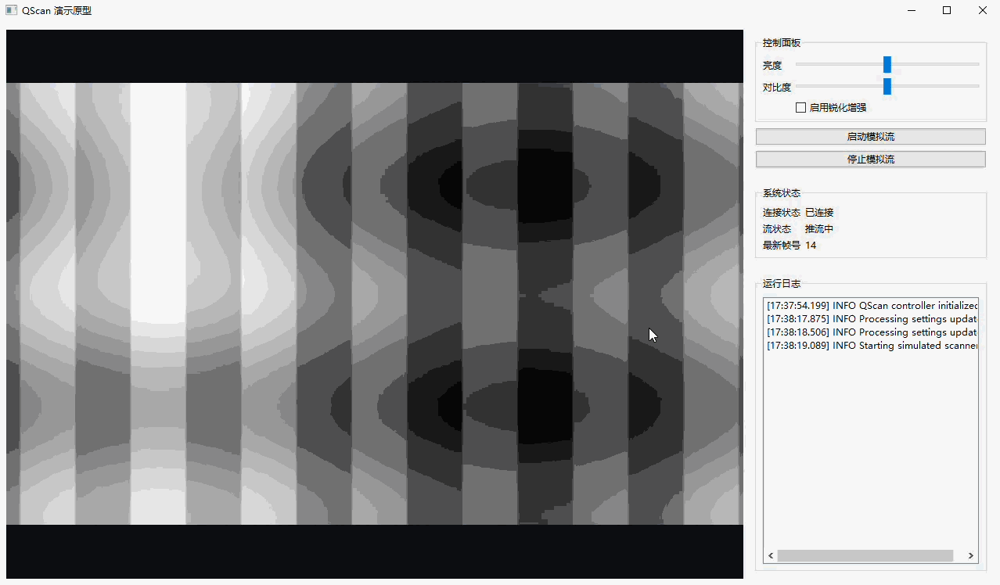

# QScan

QScan 是一个基于 Qt6 和 C++17 的桌面演示原型，当前目标是打通完整的扫描演示闭环：模拟扫描输入、异步图像处理、实时 2D 显示、参数调节、状态展示和日志输出。

## 入口说明

- 项目介绍、实现落点和演示流程见 `docs/README.md`
- 仓库级规则、环境约束和开发约定见 `AGENTS.md`

## 当前状态

第一阶段实现优先保证演示链路稳定、模块边界清晰和测试可运行，不以真实设备接入、复杂 3D 渲染或识别算法为当前目标。

## 演示图片

下面展示一个演示 GIF（相对路径 res/v01.gif）。在多数渲染器中会以图片形式显示；如果无法显示，请使用下面的链接下载或在本地查看。

- 下载/打开链接: [res/v01.gif](res/v01.gif)