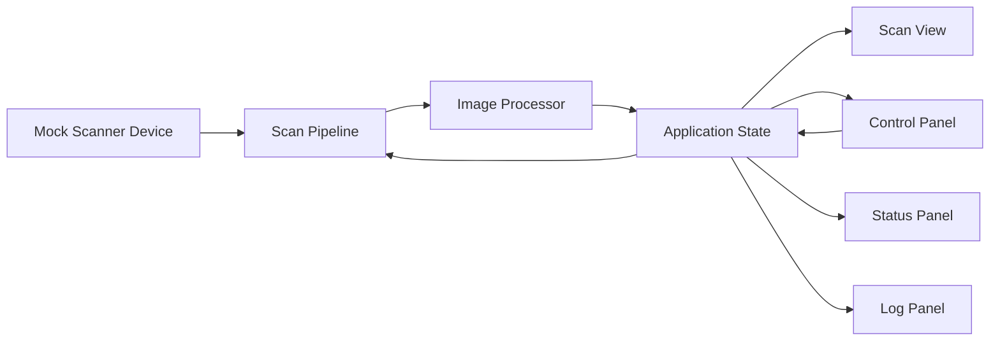

# feat: 构建 QScan 演示原型链路

## 摘要

这份计划将已确认的原型范围落成一个小而完整的 Qt/C++ 桌面应用，覆盖模拟扫描输入、异步处理链路、实时 2D 扫描视图和紧凑的操作面板。实现策略优先保证演示闭环稳定、模块边界清晰且可测试，而不是在第一阶段过早引入 3D、真实硬件协议或复杂识别能力。

---

## 问题背景

上游需求文档定义的是一个第一阶段原型，它的价值在于证明完整扫描流程成立，而不是只做单点渲染效果或算法实验。因此，这份计划需要为一个近乎空白的仓库建立应用结构，让数据输入、图像处理、结果显示、参数反馈和运行状态能够在同一个桌面流程里连贯呈现。（见 origin: docs/brainstorms/qscan-demo-prototype-requirements.md）

---

## 需求

- R1. 应用必须能够连接到模拟扫描源，并且明显展示连接状态与流状态。
- R2. 应用必须在显示前，对输入扫描帧执行至少一种可调节的图像增强处理。
- R3. 应用必须能够持续渲染扫描结果，使其在短时间演示中看起来像实时画面。
- R4. 应用必须提供关键处理参数或显示参数的用户控件，并且参数变化要能快速反馈到结果上。
- R5. 应用必须展示运行日志和状态提示，让整个系统看起来像一个完整的工程原型。
- R6. 第一阶段实现必须明确排除真实设备接入、重型 3D 工作流和复杂识别算法。

---

## 范围边界

- 本计划不包含真实扫描设备、串口协议或网络设备接入。
- 第一阶段不包含基于 VTK 的体渲染，也不包含重度 OpenGL 自定义渲染；首个版本采用更简单的 2D 显示路径，但仍然能够证明实时扫描输出成立。
- 不包含目标检测、危险品分类或其他高复杂度图像智能能力。
- 不包含账号体系、远程控制、部署或多机协同。
- 不包含面向生产环境的完整硬件异常恢复流程，超出演示安全范围的恢复能力暂不处理。

### 延后到后续工作的内容

- 更丰富的伪彩映射和处理前后对比视图：等实时显示闭环稳定后再扩展。
- VTK/OpenGL 渲染能力扩展：待基础 2D 交互模型验证通过后，单独作为后续工作推进。
- 用更接近真实设备的数据源替换模拟器：等核心状态管理和处理链路稳定后再进入下一轮。

---

## 上下文与调研

### 相关代码与模式

- 当前仓库在实现层面基本属于绿色起步状态：当前可见内容主要还是 docs/ 下的文档。
- docs/README.md 给出了预期技术栈和模块划分：Qt/C++、模拟通信、多线程处理，以及以可视化为先的交互方式。
- docs/brainstorms/qscan-demo-prototype-requirements.md 明确了已确认的第一阶段范围，并且强调完整演示闭环优先于硬件真实性。

### 经验沉淀

- 当前工作区中未发现 docs/solutions/ 或其他仓库级经验文档可供复用。

### 外部参考

- 这份计划没有额外引入外部最佳实践调研，因为仓库中暂时没有现有实现需要对齐，而且第一阶段范围本身有意保持简洁。

---

## 关键技术决策

- 第一阶段采用 Qt 原生 2D 图像显示路径，而不是强行把 VTK/OpenGL 放进首个里程碑：这样能更快满足演示需求，也能降低绿色起步阶段的搭建风险，同时为后续更强的可视化能力保留空间。
- 原型按应用组装、扫描模拟、处理链路、UI 状态与面板四个层次拆开：这样既能保住“完整系统”的叙事，也不会过早引入服务化抽象。
- 第一版图像处理保持“可调但浅”：亮度、对比度，再加一个可选的轻量增强效果，已经足够证明参数反馈链路成立，不需要把项目重心带偏到算法研发上。
- 响应性作为一等约束处理：扫描产生和图像处理必须离开主线程，UI 只消费已经准备好的帧数据和状态快照。
- 第一阶段测试以模拟器行为、处理变换和面向 UI 的状态流转为主，而不是一开始就追求大范围 UI 自动化。

---

## 开放问题

### 在规划阶段已确认

- 演示主轴应该放在哪个能力上？放在由完整数据链路支撑的实时扫描显示上，因为上游需求已经把它定义成第一演示瞬间。
- 第一阶段是否纳入高级渲染基础设施？不纳入；本计划有意采用更简单的 2D 路径，并把高级渲染延后。
- 计划是否只收缩成一个显示层 demo？不收缩；本计划覆盖从模拟输入到状态与日志输出的完整第一阶段范围。

### 延后到实现阶段决定

- 模拟扫描器的具体帧格式和尺寸：等实现阶段把 Qt 图像表示方式确定后再最终定下来。
- 亮度和对比度之外的那个可选增强效果到底是边缘检测还是其他轻量滤波：实现时可根据“代码最少但展示效果最明显”的标准再选。
- 日志更适合用列表模型、文本面板还是表格模型展示：计划要求它必须可见，但具体控件形态可在 UI 组装阶段决定。

---

## 输出结构

    docs/
      brainstorms/
        qscan-demo-prototype-requirements.md
      plans/
        2026-05-23-001-feat-qscan-demo-prototype-plan.md
    src/
      main.cpp
      app/
        ApplicationController.h
        ApplicationController.cpp
        AppState.h
        AppState.cpp
      core/
        ScanFrame.h
        ProcessingSettings.h
      pipeline/
        MockScannerDevice.h
        MockScannerDevice.cpp
        ImageProcessor.h
        ImageProcessor.cpp
        ScanPipeline.h
        ScanPipeline.cpp
      ui/
        MainWindow.h
        MainWindow.cpp
        ScanViewWidget.h
        ScanViewWidget.cpp
        ControlPanel.h
        ControlPanel.cpp
        StatusPanel.h
        StatusPanel.cpp
        LogPanel.h
        LogPanel.cpp
    tests/
      CMakeLists.txt
      MockScannerDeviceTests.cpp
      ImageProcessorTests.cpp
      ApplicationControllerTests.cpp
      AppStateIntegrationTests.cpp
    CMakeLists.txt

---

## 高层技术设计

> 这一节用于说明预期实现形态，只作为评审时的方向性指导，不是实现规格说明。实际编码时应把它当作上下文，而不是直接照抄的代码方案。

主窗口应当从一个面向 UI 的中心状态模型读取数据，而不是让每个控件直接绑定到底层 worker 对象。模拟器负责产生原始帧，处理阶段按当前设置完成转换，应用控制器再把可显示结果以及状态、日志更新统一发布给 UI 层。

---

## 实现单元

### U1. 搭建 Qt 应用骨架与共享状态模型

**Goal:** 创建可执行入口、基础构建结构以及共享的应用状态模型，为后续单元提供统一底座。

**Requirements:** R1, R3, R4, R5, R6

**Dependencies:** None

**Files:**
- Create: CMakeLists.txt
- Create: src/main.cpp
- Create: src/app/ApplicationController.h
- Create: src/app/ApplicationController.cpp
- Create: src/app/AppState.h
- Create: src/app/AppState.cpp
- Create: src/core/ScanFrame.h
- Create: src/core/ProcessingSettings.h
- Create: tests/CMakeLists.txt
- Create: tests/ApplicationControllerTests.cpp

**Approach:**
- 建立一个最小可用的 Qt 桌面目标，并用中心控制器统一持有处理链路生命周期、当前设置、连接状态、当前帧快照以及简化日志流抽象。
- 将 AppState 作为面向 UI 的统一契约，让后续控件只订阅稳定状态，而不是直接接触模拟器或处理链路内部。
- 提前定义帧数据和处理设置类型，使后续单元围绕同一套原始帧、处理结果和可调参数语义展开。

**Execution note:** 先补控制器与状态对象的默认启动态测试，再往上叠 UI 控件。

**Patterns to follow:**
- 顶层概念命名和分层与 docs/README.md 以及上游需求文档保持一致，延续仓库先文档后实现的结构方式。

**Test scenarios:**
- Happy path: 应用控制器初始化后，模拟器处于未连接状态，当前帧为空，处理参数为默认值，日志为空或只包含启动记录。
- Happy path: 通过控制器更新处理参数后，下游读取到的共享状态快照同步变化。
- Edge case: 重复应用相同设置时，不应重复产生状态切换或噪声日志。
- Error path: 在尚未启动流的情况下执行停止操作，控制器仍保持安全空闲状态。
- Integration: 控制器产生的状态更新可被 UI 层消费者观察到，但不会暴露处理链路内部细节。

**Verification:**
- 项目能够在不依赖具体 UI 控件的前提下实例化控制器和状态对象，后续单元可以直接依赖这些类型，无需重新定义状态归属。

---

### U2. 增加模拟扫描源与异步处理链路

**Goal:** 生成连续的模拟扫描帧，并在不阻塞主线程的前提下把它们转换成可显示的数据。

**Requirements:** R1, R2, R3, R4, R6

**Dependencies:** U1

**Files:**
- Create: src/pipeline/MockScannerDevice.h
- Create: src/pipeline/MockScannerDevice.cpp
- Create: src/pipeline/ImageProcessor.h
- Create: src/pipeline/ImageProcessor.cpp
- Create: src/pipeline/ScanPipeline.h
- Create: src/pipeline/ScanPipeline.cpp
- Create: tests/MockScannerDeviceTests.cpp
- Create: tests/ImageProcessorTests.cpp

**Approach:**
- 实现一个模拟扫描器，通过定时器或 worker 驱动循环持续发出帧数据，并保证画面变化足以在演示时看起来像实时流。
- 建立清晰的处理链路边界，接收原始帧、应用当前处理参数，并把处理后的结果回传给控制器。
- 使用 Qt 线程原语，让采集和处理都运行在 UI 线程之外，同时保持对象归属关系简单明确。

**Execution note:** 先用测试把模拟器和处理器行为固定下来，再接入控制器。

**Patterns to follow:**
- 延续 docs/README.md 中已经描述的逻辑分层：模拟通信、多线程处理，以及清晰的可视化交接边界。

**Test scenarios:**
- Happy path: 启动模拟设备后，能够持续产生帧序列，并将流状态报告为活动中。
- Happy path: 对同一输入帧应用亮度和对比度设置后，处理结果变化可重复且稳定。
- Edge case: 空帧或全零帧输入时，处理器仍能返回合法图像结果，而不是崩溃。
- Edge case: 快速连续修改参数时，后续帧应正确应用最新设置，且不会破坏正在处理中的状态。
- Error path: 在活跃流状态下停止处理链路时，应安全排空并回到空闲状态。
- Integration: 处理后的帧按顺序回传给控制器，且不会引发 UI 线程对象归属错误。

**Verification:**
- 系统能够为了演示目的稳定模拟实时扫描流，同时把帧生成和图像处理工作留在主窗口线程之外。

---

### U3. 构建主窗口与实时扫描显示路径

**Goal:** 在桌面界面中展示处理后的帧流，让观察者一眼就能理解这是一个“实时扫描系统”。

**Requirements:** R1, R2, R3, R5, R6

**Dependencies:** U1, U2

**Files:**
- Create: src/ui/MainWindow.h
- Create: src/ui/MainWindow.cpp
- Create: src/ui/ScanViewWidget.h
- Create: src/ui/ScanViewWidget.cpp
- Modify: src/app/ApplicationController.h
- Modify: src/app/ApplicationController.cpp
- Create: tests/AppStateIntegrationTests.cpp

**Approach:**
- 构建一个绑定 AppState 的主窗口，并通过轻量 2D 控件路径渲染最新处理结果。
- 在扫描视图附近展示清晰的连接状态和流状态，让实时图像与运行状态在演示中互相强化。
- 保持控件逻辑尽量薄，把控制器和状态模型中的值转换成可显示属性，而不是把处理链路决策塞进 UI。

**Patterns to follow:**
- 以扫描视图作为主界面核心区域，延续上游需求文档里“数据进来，图像出来”的主叙事。

**Test scenarios:**
- Happy path: 当控制器发布处理结果后，扫描视图持续刷新，并保留最新的有效图像。
- Happy path: 开始推流后，连接状态和流状态指示从空闲切换到活动中。
- Edge case: 首帧到来之前，主窗口应显示明确的空状态占位，而不是损坏的渲染区域。
- Error path: 如果处理链路报告可恢复的中断，UI 应显示最后一帧并同步状态变化，而不是不可预测地清空画面。
- Integration: 面向 UI 的状态变化可从控制器传递到主窗口，但不会让主窗口直接耦合 worker 对象。

**Verification:**
- 打开主窗口并启动模拟流后，系统能够稳定展示实时图像，同时让空闲态和活动态都清晰可理解。

---

### U4. 增加控制面板、状态面板和运行日志

**Goal:** 用可调控件、可见反馈和工程化运行上下文补完整个原型闭环。

**Requirements:** R1, R2, R4, R5, R6

**Dependencies:** U1, U2, U3

**Files:**
- Create: src/ui/ControlPanel.h
- Create: src/ui/ControlPanel.cpp
- Create: src/ui/StatusPanel.h
- Create: src/ui/StatusPanel.cpp
- Create: src/ui/LogPanel.h
- Create: src/ui/LogPanel.cpp
- Modify: src/ui/MainWindow.h
- Modify: src/ui/MainWindow.cpp
- Modify: src/app/AppState.h
- Modify: src/app/AppState.cpp
- Modify: src/app/ApplicationController.h
- Modify: src/app/ApplicationController.cpp
- Modify: tests/AppStateIntegrationTests.cpp

**Approach:**
- 增加紧凑的控制区域，覆盖处理参数和流生命周期操作，并确保交互延迟足够低，让演示时“调一下就有变化”。
- 将设备状态、流状态和最近日志事件都提升为一等 UI 数据，让应用看起来像系统原型，而不是单纯图像查看器。
- 日志量刻意保持少而高信号，只记录启动、连接、流切换、参数变化和可恢复错误这类关键事件。

**Execution note:** 先补控制变化和日志输出相关的集成型状态测试，再打磨控件布局。

**Patterns to follow:**
- 严格遵循上游需求里“参数变化要快速可见”和“日志/状态用于增强工程可信度而非喧宾夺主”的要求。

**Test scenarios:**
- Happy path: 从控制面板调整亮度或对比度后，后续帧画面明显变化，且设置状态同步更新。
- Happy path: 启动和停止模拟设备时，状态面板同步变化，并追加对应日志记录。
- Edge case: 参数滑块调到极值时，界面仍然显示合法图像，且不会卡死。
- Edge case: 快速连续修改控制项时，以最新参数值为准，不会在旧值和新值之间来回抖动。
- Error path: 模拟一个可恢复的处理链路故障后，日志和状态面板能显示异常，但不会拖垮整个 UI。
- Integration: 在后台流持续运行时，控制、状态和日志组合仍能保持界面响应性。

**Verification:**
- 一次短演示中可以完整展示启动、实时画面、参数调节和运行反馈，不会出现状态变化不可见或延迟难以解释的问题。

---

## 系统级影响

- **Interaction graph:** MainWindow 读取 AppState，并把用户动作委托给 ApplicationController；ApplicationController 负责协调 MockScannerDevice 和 ScanPipeline；处理后的帧和运行事件再统一回流到 AppState，供各个 UI 面板消费。
- **Error propagation:** worker 层错误应被转换成安全的状态更新和日志更新，保证 UI 稳定，并允许演示继续进行或有序停止。
- **State lifecycle risks:** 快速帧刷新和频繁参数变更可能产生旧帧覆盖新帧、旧参数污染新结果等竞争风险，因此控制器必须持有唯一权威的最新状态。
- **Integration coverage:** 风险最高的路径是“后台产帧到 UI 刷新”的端到端交接，尤其是在参数持续变化时，这部分必须有明确测试覆盖。
- **Unchanged invariants:** 这份第一阶段计划不承诺硬件真实性、高级渲染能力或生产级恢复能力，只承诺一个连贯且响应及时的原型闭环。

---

## 风险与依赖

| 风险 | 缓解方式 |
|------|------------|
| Qt 项目在绿色起步仓库中的基础搭建耗时超预期 | 把首个目标收紧为一个桌面可执行程序、一个测试目标，并且不在 v1 引入可选渲染栈 |
| 后台处理把线程细节泄漏到 UI 控件中 | 所有 worker 输出都先回到 ApplicationController 和 AppState，而不是让控件直接订阅 |
| 模拟数据流看起来过于“假”，不像扫描系统 | 使用可重复但有变化的帧模式，让画面有运动感且能明显响应处理参数 |
| 推流过程中 UI 控件反馈出现明显卡顿 | 保持处理逻辑轻量，并让参数应用遵循“最新值生效”的策略 |

---

## 文档与运行说明

- 实现完成后更新 docs/README.md，让仓库能够说明所选构建方式、模块结构以及第一阶段演示流程。
- 演示说明应聚焦可观察结果：启动流、查看实时图像、调整参数、观察状态和日志输出。
- 如果实现过程中比预期更早出现对 VTK/OpenGL 的强依赖，应把它记成后续计划，而不是直接膨胀当前计划范围。

---

## 来源与参考

- Origin document: docs/brainstorms/qscan-demo-prototype-requirements.md
- Project direction: docs/README.md